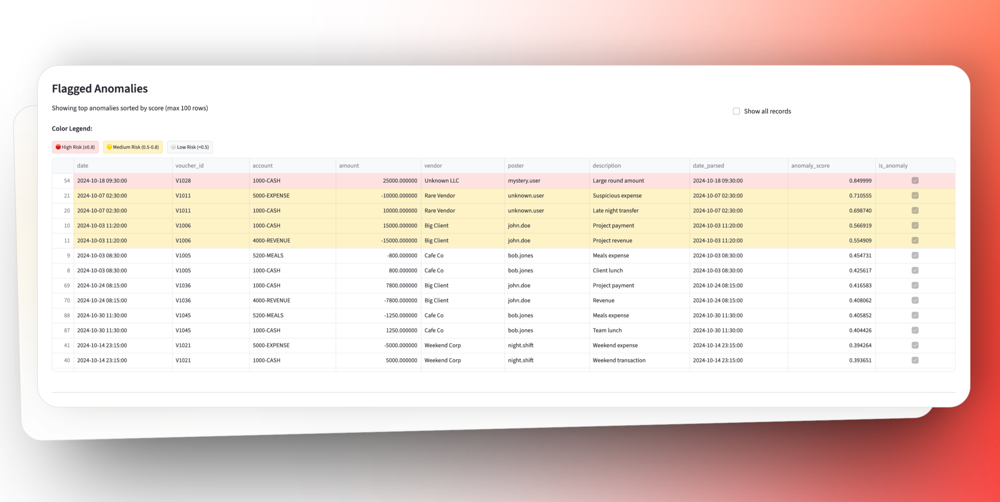

# Anomaly Detection & Explanation in Accounting Data Using LLMs

A production-quality application for detecting and explaining anomalies in accounting ledger data using machine learning, rule-based detection, and LLM-powered natural language explanations.




## Table of Contents

- [Overview](#overview)
- [Features](#features)
- [Architecture](#architecture)
- [Installation](#installation)
- [Quick Start](#quick-start)
- [Usage Guide](#usage-guide)
- [Configuration](#configuration)
- [API Keys](#api-keys)
- [Testing](#testing)
- [Project Structure](#project-structure)
- [Technical Details](#technical-details)
- [Privacy & Security](#privacy--security)
- [Contributing](#contributing)
- [License](#license)

## Overview

This application combines multiple anomaly detection techniques to identify suspicious entries in accounting ledgers and provides human-understandable explanations using state-of-the-art LLMs.

**Key Technologies:**

- **Detection**: IsolationForest, XGBoost, Rule-based systems
- **Explainability**: SHAP values, Groq Llama-3.3-70b-versatile
- **Frontend**: Streamlit with modern, responsive UI
- **User Study**: Built-in feedback collection and metrics analysis

## Features

### Multi-Modal Anomaly Detection

- **IsolationForest**: Unsupervised outlier detection in feature space
- **XGBoost**: Supervised typicality modeling for expected amount prediction
- **Rule-Based**: Business logic checks (unbalanced vouchers, duplicates, timing violations)
- **Ensemble**: Weighted combination with robust MAD-based thresholding

### Explainable AI

- **SHAP Values**: Local feature importance for individual predictions
- **LLM Explanations**: Natural language explanations via Groq API
- **Structured Output**: JSON schema validation with Pydantic
- **Fallback Mechanism**: Template-based explanations when LLM unavailable

### Modern UI

- **Multi-Page App**: Organized workflow from upload to analysis
- **Interactive Tables**: AgGrid with filtering and sorting
- **Visualizations**: Plotly charts for distributions and metrics
- **Real-Time Feedback**: User study interface with confidence ratings

### User Study & Analytics

- **Feedback Collection**: Track user decisions and timing
- **Performance Metrics**: Precision, recall, F1 score, agreement rate
- **Confusion Matrix**: Visualize model performance
- **Export**: CSV download of results and metrics

## Architecture

```
┌─────────────────────────────────────────────────────────────────────┐
│                     Streamlit Frontend                            │
│  Upload → Detect → Batch Explain → Individual Explain → Results   │
└────────────────────────────────┬────────────────────────────────────┘
                                │
┌────────────────────────────────┴────────────────────────────────────┐
│                     Core Pipeline                                 │
├─────────────────────────────────────────────────────────────────────┤
│  1. Feature Engineering (features.py)                             │
│     ├─ Temporal: weekday, hour, month-end                         │
│     ├─ Statistical: amount_z, amount_log                          │
│     ├─ Behavioral: vendor_freq, poster_freq                       │
│     └─ Patterns: duplicates, balanced_voucher                     │
│                                                                   │
│  2. Rule-Based Detection (rules.py)                               │
│     ├─ Unbalanced vouchers                                        │
│     ├─ Duplicate transactions                                     │
│     ├─ Timing violations                                          │
│     └─ Unusual account pairs                                      │
│                                                                   │
│  3. ML Detection (detectors.py)                                   │
│     ├─ IsolationForest → anomaly scores                           │
│     ├─ XGBoost → typicality scores                                │
│     └─ Ensemble → weighted combination                            │
│                                                                   │
│  4. Explainability (shap_utils.py, llm_explainer.py)              │
│     ├─ SHAP → feature contributions                               │
│     ├─ Groq API → natural language                                │
│     └─ Pydantic → structured validation                           │
│                                                                   │
│  5. Persistence (persistence.py)                                  │
│     └─ User feedback → CSV logging                                │
└─────────────────────────────────────────────────────────────────────┘
```

## Installation

### Prerequisites

- Python 3.10 or higher
- pip package manager
- (Optional) Virtual environment tool

### Setup

1. **Clone the repository**

```bash
cd anomaly-xai
```

2. **Create virtual environment**

```bash
python3 -m venv .venv
source .venv/bin/activate  # On Windows: .venv\Scripts\activate
```

3. **Install dependencies**

```bash
pip install -r requirements.txt
```

4. **Configure API keys**

```bash
cp .env.example .env
# Edit .env and add your Groq API key
```

5. **Verify installation**

```bash
pytest tests/ -v
```

### Using Makefile (Unix/macOS)

```bash
make setup  # Install dependencies
make test   # Run tests
make run    # Launch application
```

## Quick Start

### 1. Start the application

```bash
streamlit run app/Home.py
```

The app will open in your browser at `http://localhost:8501`

### 2. Upload & Preview Data

- Navigate to **Upload & Preview**
- Check "Use sample data" or upload your CSV
- Click "Build Features"

### 3. Detect Anomalies

- Go to **Detect Anomalies**
- Adjust sensitivity slider (default: k=2.5)
- Click "Run Detection"

### 4. Batch Explain & Review

- Visit **Batch Explain & Review**
- Generate explanations for multiple anomalies
- Provide batch feedback

### 5. Individual Explain & Review

- Go to **Individual Explain & Review**
- Select specific anomaly from dropdown
- Click "Explain This Row"
- Provide individual feedback

### 6. User Study Results

- Check **User Study Results**
- View performance metrics
- Export data

## Usage Guide

### Data Format

Your CSV should contain these columns:

| Column      | Type     | Required | Description           |
| ----------- | -------- | -------- | --------------------- |
| date        | datetime | Yes      | Transaction timestamp |
| voucher_id  | string   | Yes      | Unique voucher ID     |
| account     | string   | Yes      | Account code          |
| amount      | float    | Yes      | Transaction amount    |
| debit       | float    | No       | Debit amount          |
| credit      | float    | No       | Credit amount         |
| vendor      | string   | No       | Vendor name           |
| poster      | string   | No       | User who posted       |
| description | string   | No       | Transaction details   |

**Example:**

```csv
date,voucher_id,account,debit,credit,amount,vendor,poster,description
2024-10-01 09:15:00,V1001,1000-CASH,5000.00,0.00,5000.00,ABC Corp,john.doe,Office supplies
2024-10-01 09:15:00,V1001,5000-EXPENSE,0.00,5000.00,-5000.00,ABC Corp,john.doe,Expense entry
```

### Adjusting Sensitivity

The threshold multiplier `k` controls detection sensitivity:

- **k = 1.5-2.0**: Aggressive (more anomalies, more false positives)
- **k = 2.5**: Balanced (default)
- **k = 3.0-4.0**: Conservative (fewer anomalies, fewer false positives)

Formula: `threshold = median(scores) + k × MAD(scores)`

### Feature Flags

Toggle features in `core/config.py`:

```python
ENABLE_XGBOOST = True   # Use XGBoost for typicality scoring
ENABLE_SHAP = True      # Compute SHAP explanations
ENABLE_LLM = True       # Use LLM for natural language
```

**Quick Demo Mode** (fast, no ML):

```python
ENABLE_XGBOOST = False
ENABLE_SHAP = False
```

## Configuration

### Environment Variables

Create `.env` file:

```bash
GROQ_API_KEY=gsk_your_key_here
```

### Config Parameters

Edit `core/config.py`:

```python
# Detection weights
WEIGHT_IFOREST = 0.4    # IsolationForest weight
WEIGHT_XGBOOST = 0.3    # XGBoost weight
WEIGHT_RULES = 0.3      # Rules weight

# Threshold
THRESHOLD_K = 2.5       # MAD multiplier

# IsolationForest
IFOREST_CONTAMINATION = 0.1
IFOREST_N_ESTIMATORS = 200

# XGBoost
XGBOOST_N_ESTIMATORS = 100
XGBOOST_MAX_DEPTH = 6
```

## API Keys

### Groq API

1. Visit [https://console.groq.com](https://console.groq.com)
2. Sign up for free account
3. Create API key
4. Add to `.env` file

**Without API Key**: The system will use template-based explanations instead of LLM-generated ones.

## Testing

### Run all tests

```bash
pytest tests/ -v
```

### Run specific test file

```bash
pytest tests/test_features.py -v
```

### Test coverage

```bash
pytest tests/ --cov=core --cov-report=html
```

### Test categories

- `test_features.py`: Feature engineering validation
- `test_detectors.py`: Detection model accuracy
- `test_llm_schema.py`: Schema validation

## Project Structure

```
anomaly-xai/
├── app/                          # Streamlit application
│   ├── Home.py                  # Main entry point
│   ├── ui_theme.py              # Theme and styling
│   ├── components.py            # Reusable UI components
│   └── pages/                   # Multi-page app
│       ├── 1_Upload_&_Preview.py
│       ├── 2_Detect_Anomalies.py
│       ├── 3_Batch_Explain_&_Review.py
│       ├── 4_Individual_Explain_&_Review.py
│       └── 5_User_Study_Results.py
│
├── core/                        # Core logic
│   ├── config.py               # Configuration
│   ├── schema.py               # Pydantic models
│   ├── features.py             # Feature engineering
│   ├── rules.py                # Rule-based detection
│   ├── detectors.py            # ML models
│   ├── shap_utils.py           # SHAP explanations
│   ├── llm_explainer.py        # LLM integration
│   └── persistence.py          # Data logging
│
├── data/                        # Data files
│   ├── sample_ledger.csv       # Sample data (~120 rows)
│   └── README.md               # Data documentation
│
├── results/                     # User study results
│   └── user_study_results.csv  # Generated at runtime
│
├── tests/                       # Unit tests
│   ├── test_features.py
│   ├── test_detectors.py
│   └── test_llm_schema.py
│
├── requirements.txt             # Python dependencies
├── .env.example                # Environment template
├── .gitignore                  # Git ignore rules
├── Makefile                    # Build automation
└── README.md                   # This file
```

## Technical Details

### Anomaly Detection Methods

#### 1. IsolationForest

- **Type**: Unsupervised
- **Principle**: Anomalies are easier to isolate in tree structures
- **Output**: Anomaly score (0-1)
- **Strengths**: Fast, no labels needed, handles high dimensions

#### 2. XGBoost Typicality

- **Type**: Supervised (self-supervised)
- **Principle**: Learn "typical" amounts, flag large residuals
- **Output**: Residual-based score (0-1)
- **Strengths**: Captures non-linear patterns, explainable

#### 3. Rule-Based

- **Type**: Deterministic
- **Rules**:
  - Unbalanced vouchers (debit ≠ credit)
  - Duplicate amounts (same vendor, same day)
  - Timing violations (weekends, late night)
  - Unusual account pairs
  - Large round amounts
- **Output**: Boolean flags + normalized score

### Feature Engineering

**Temporal Features:**

- `weekday`, `hour`, `month`, `is_month_end`

**Statistical Features:**

- `amount_log`: Log-transformed amount
- `amount_z`: Z-score within account
- `is_round_amount`: Ends in 00/000

**Behavioral Features:**

- `vendor_freq`: Vendor appearance count
- `poster_freq`: Poster appearance count
- `account_pair_freq`: Account co-occurrence

**Pattern Features:**

- `duplicate_amount_same_day`: Same amount, vendor, date
- `is_balanced_voucher`: Voucher debits = credits

### LLM Integration

**Model**: Groq Llama-3.3-70b-versatile

**Prompt Structure:**

1. **System Prompt**: Defines role and JSON schema
2. **User Prompt**: Provides context (row data, rules, SHAP)
3. **Parsing**: Extract JSON, validate with Pydantic

**Schema Fields:**

- `short_title`: Brief description
- `rationale`: Detailed explanation
- `fields_referenced`: Key fields used
- `risk_level`: low/medium/high
- `suggested_action`: What to do
- `anomaly_type`: Category
- `provenance`: Supporting evidence

### Robust Thresholding

**Median Absolute Deviation (MAD)**:

```
threshold = median(scores) + k × median(|scores - median(scores)|)
```

**Advantages over mean±std:**

- Robust to outliers
- Better for skewed distributions
- Mathematically sound

## Privacy & Security

- **Local Processing**: All data processed on your machine
- **No Storage**: LLM responses not persisted externally
- **API Security**: Keys stored in `.env`, never committed
- **User Study Data**: Only feedback stored, no raw transactions
- **Audit Trail**: All user actions logged locally

## Contributing

Contributions welcome! Please:

1. Fork the repository
2. Create feature branch (`git checkout -b feature/new-feature`)
3. Commit changes (`git commit -m 'Add new feature'`)
4. Push to branch (`git push origin feature/new-feature`)
5. Open Pull Request

### Development Guidelines

- Follow PEP 8 style guide
- Add tests for new features
- Update documentation
- Use type hints
- Write docstrings

## License

This project is licensed under the MIT License - see LICENSE file for details.

## Acknowledgments

- **Groq**: Fast LLM inference via GroqCloud
- **Streamlit**: Rapid web app development
- **scikit-learn**: ML algorithms
- **XGBoost**: Gradient boosting
- **SHAP**: Model explanations
- **Plotly**: Interactive visualizations

## Support

For issues, questions, or suggestions:

- Open a GitHub issue
- Check documentation in `/docs`
- Review sample data in `/data/README.md`

**Built with ❤️ for transparent and explainable AI in finance**

_Version 1.0.0 | October 2025_
